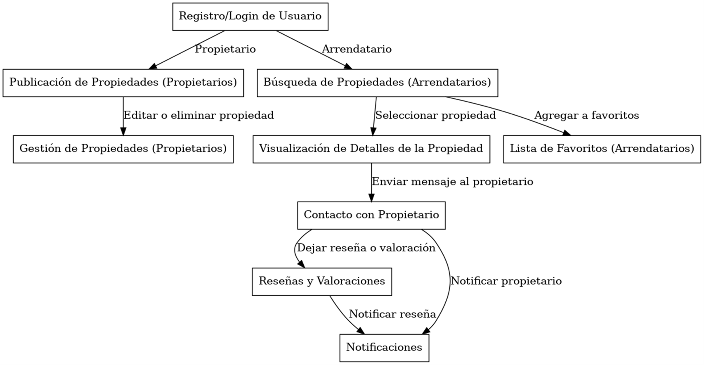
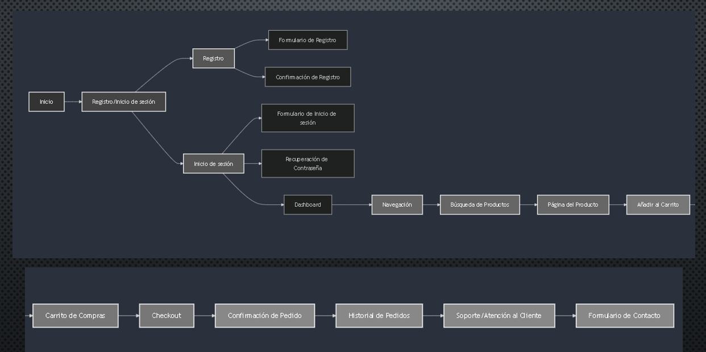

# View.Home

### Página web para la gestión y visualización de propiedades en arriendo

## Tabla de Contenidos

- [Propósito del Proyecto](#proposito-del-proyecto)
- [Contexto del Proyecto](#contexto-del-proyecto)
- [Identificación de Stakeholders](#identificacion-de-stakeholders)
- [Requerimientos](#requerimientos)
  - [Funcionales](#funcionales)
  - [No funcionales](#no-funcionales)
- [Historias de Usuario](#historias-de-usuario)
- [Diagrama de Procesos](#diagrama-de-procesos)
- [Diagrama de Experiencias de Usuario](#diagrama-de-experiencias-de-usuario)

## Propósito del Proyecto

El proyecto **View.Home** consiste en desarrollar una página web para la gestión y visualización de propiedades en arriendo. Su objetivo es facilitar la interacción entre propietarios y arrendatarios, proporcionando una plataforma digital eficiente para la búsqueda, consulta y administración de propiedades arrendadas.

**Objetivos Generales:**
1. Optimizar la búsqueda de propiedades mediante un sistema de filtros.
2. Facilitar la gestión de propiedades para los propietarios.
3. Promover una comunicación directa y segura entre arrendatarios y propietarios.
4. Proveer una experiencia de usuario amigable y responsiva.

## Contexto del Proyecto

El proyecto está dirigido a un mercado en crecimiento de arrendamientos de propiedades, donde se requiere una solución digital intuitiva y accesible desde dispositivos móviles para facilitar el proceso de alquiler de inmuebles.

La plataforma está diseñada para ser una solución competitiva en el sector inmobiliario, atendiendo tanto a personas que buscan propiedades residenciales como comerciales.

## Identificación de Stakeholders

### 1. Propietarios de Inmuebles
- **Rol:** Publicar y gestionar propiedades en arriendo.
- **Intereses:** Maximizar la visibilidad y atraer arrendatarios.
- **Necesidades:** Panel de control intuitivo, estadísticas, y seguridad en la gestión.

### 2. Arrendatarios
- **Rol:** Buscar y arrendar propiedades.
- **Intereses:** Encontrar propiedades que se ajusten a su presupuesto y necesidades.
- **Necesidades:** Herramientas de búsqueda avanzadas y un sistema de contacto eficiente.

### 3. Administradores del Sistema
- **Rol:** Monitorear y asegurar el correcto funcionamiento de la plataforma.
- **Intereses:** Garantizar una experiencia fluida y proteger los datos de los usuarios.
- **Necesidades:** Herramientas de moderación y sistemas de seguridad robustos.

### 4. Desarrolladores del Sistema
- **Rol:** Desarrollar, mantener e implementar nuevas funcionalidades.
- **Intereses:** Crear una plataforma funcional y escalable.
- **Necesidades:** Requerimientos claros, herramientas de desarrollo y feedback constante.

### 5. Entidad de Seguridad y Regulación
- **Rol:** Asegurar el cumplimiento de normativas.
- **Intereses:** Garantizar que la plataforma cumpla con las regulaciones de protección de datos y contratos.
- **Necesidades:** Implementación de políticas de seguridad y revisión de términos.

## Requerimientos

### Funcionales

1. **Registro y autenticación de usuarios:**
   - El sistema permitirá el registro, inicio de sesión y recuperación de contraseñas.

2. **Gestión de propiedades (para propietarios):**
   - Publicar, editar y eliminar propiedades con detalles completos.

3. **Búsqueda y filtrado de propiedades (para arrendatarios):**
   - Búsqueda por filtros como ubicación, precio, y tipo de propiedad.

4. **Visualización detallada de propiedades:**
   - Página de detalles con fotos, descripción, y contacto.

5. **Sistema de contacto entre arrendatarios y propietarios:**
   - Mensajería directa con notificaciones para los propietarios.

### No Funcionales

1. **Seguridad:**
   - Cifrado de datos sensibles y políticas claras de privacidad.

2. **Rendimiento:**
   - Respuesta rápida, incluso con muchos usuarios simultáneos.

3. **Compatibilidad y accesibilidad:**
   - Diseño responsivo y accesible para personas con discapacidades.

4. **Escalabilidad:**
   - Capacidad de crecimiento sin comprometer el rendimiento.

5. **Disponibilidad:**
   - Tiempo de actividad del 99.9%, con respaldo y soporte técnico.
     
## Historias de Usuario

1. **Como propietario**, quiero poder registrarme y acceder a la plataforma fácilmente, para poder gestionar mis propiedades y publicarlas en el sistema de arriendo.

2. **Como arrendatario**, quiero tener la opción de registrarme o iniciar sesión, para poder guardar mis propiedades favoritas y contactar a los propietarios.

3. **Como propietario**, quiero poder agregar y eliminar propiedades de manera rápida y sencilla, para que las propiedades disponibles estén siempre actualizadas y reflejen mi oferta actual.

4. **Como arrendatario**, quiero poder filtrar las propiedades por precio, ubicación y características, para encontrar propiedades que se ajusten a mis necesidades y presupuesto.

5. **Como propietario**, quiero recibir notificaciones cuando un arrendatario se interese en una propiedad, para poder responder rápidamente y maximizar mis oportunidades de arrendar la propiedad.

## Diagrama de Procesos

## Diagrama de Experiencias de Usuario

